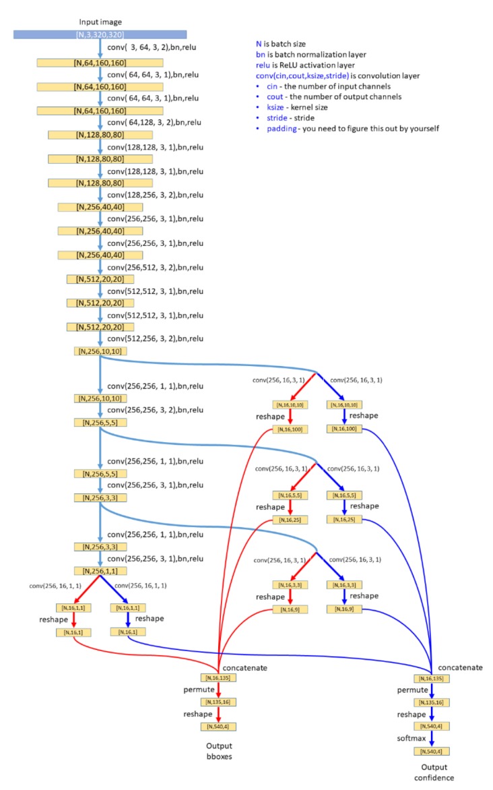

# SSD
## Introduction 
This is a foundational implementation of SSD Object Detection. SSD divides the image into grids and outputs bounding boxes in each cell

## Architecture
It is based on [SSD: Single Shot MultiBox Detector] (https://arxiv.org/pdf/1512.02325.pdf). The architecture consists of a series of Convolutional layers, the output of the convolutional layers represents the different types of grids possible. The grids are 10 x 10, 5x5, 3x3 and 1x1. There are two paths for the predictions; one for the bounding boxes and one for the class confidences. The architecture is given below:

## Implementation
The neural network was trained for 250 epochs with a learning rate of 1e-4, using the Adam optimizer. In addition to the basic implementation Non-Maximum Suppression was implemented to make the model better accurate.

